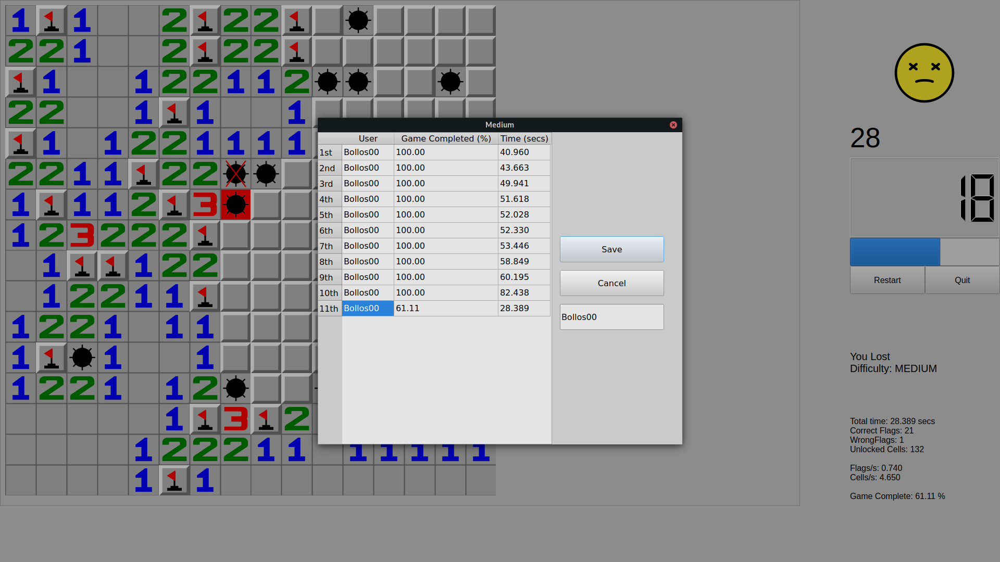

# [LibreMines](https://github.com/Bollos00/LibreMines)



## Introduction

LibreMines is a [Free/Libre](https://en.wikipedia.org/wiki/Free_software) and [Open Source](https://en.wikipedia.org/wiki/Open-source_software) software Qt based Minesweeper clone available for GNU/Linux, FreeBSD, macOS and Windows systems.

The game has dark and light themes, is widely customizable, has options to create customizable fields, allows the user to play with the keyboard, among other things.

The source code is licensed under the [GNU General Public License at version 3](https://www.gnu.org/licenses/gpl-3.0.en.html) (or any later version), this includes all files inside the `src` directory. The artworks are licensed under the [Creative Commons Attribution-Share Alike 4.0 International](https://creativecommons.org/licenses/by-sa/4.0/), this includes all files on the `share` directory.

## Installing from Package Manager

### Arch User Repository

[LibreMines is available on the Arch User Repository](https://aur.archlinux.org/packages/libremines/). It can be installed with an AUR helper:

To install using `yay`:
```sh
yay -S libremines
```

To install using `paru`:
```sh
paru -S libremines
```

To install manually using `git`:
```sh
git clone https://aur.archlinux.org/libremines.git
cd libremines
makepkg -si
```

### FreeBSD

[LibreMines is available in FreeBSD ports tree](https://www.freshports.org/games/LibreMines). It can be installed with `pkg`:

```sh
pkg install libremines
```

### Flatpak

There is a [package for LibreMines available on FlatHub](https://flathub.org/apps/details/io.github.Bollos00.LibreMines). The package can be installed, via command line, with:

```sh
flatpak install flathub io.github.Bollos00.LibreMines
```

## Binary installation for Windows

For Windows systems, you can just get one of the releases [here](https://github.com/Bollos00/LibreMines/releases) and follow these steps:

* Make sure you have [Microsoft Visual C++ Redistributable](https://learn.microsoft.com/en-us/cpp/windows/latest-supported-vc-redist) installed.
* Download the latest version of file `libremines_vX.X.X_windows_release.zip` available
* Extract it to your preferred location

You can run the executable `libremines.exe`. You can also add a desktop shortcut or put it on the taskbar.

## Compiling from the source code

### Installation Dependencies

The following dependencies are required for building and running LibreMines:
* [Qt Core](https://doc.qt.io/qt-5/qtcore-index.html) >= 5.12
* [Qt Gui](https://doc.qt.io/qt-5/qtgui-index.html) >= 5.12
* [Qt Widgets](https://doc.qt.io/qt-5/qtwidgets-index.html) >= 5.12
* [Qt SVG](https://doc.qt.io/qt-5/qtsvg-index.html) >= 5.12
* [Qt Multimedia](https://doc.qt.io/qt-5/qtmultimedia-index.html) >= 5.12
* [CMake](https://cmake.org/) >= 3.5

On Arch Linux and derivatives systems, the dependencies can be installed with `pacman`:
```sh
sudo pacman -Sy --needed base-devel qt6-base qt6-svg qt6-multimedia cmake
```

For Ubuntu, you can install the dependencies with the following command:
```sh
sudo apt-get install build-essential qt6-base-dev cmake libqt6svg6-dev qt6-multimedia-dev libgl1-mesa-dev
```

On Fedora, install the dependencies with:
```sh
sudo dnf install qt6-qtbase-devel qt6-qtsvg-devel cmake qt6-qtmultimedia-devel git
```

On FreeBSD systems, install the packages [qt6-base](https://www.freshports.org/devel/qt6-base), [qt6-svg](https://www.freshports.org/devel/qt6-svg), [qt6-multimedia](https://www.freshports.org/devel/qt6-multimedia) [git](https://www.freshports.org/devel/git/) and [cmake](https://www.freshports.org/devel/cmake/).

```sh
su -
pkg install qt6-base qt6-svg qt6-multimedia git cmake
```

On macOS systems, install the dependencies with [homebrew](https://brew.sh/):
```sh
brew install cmake ninja qt
```

For others systems, check the [qt online installers](https://download.qt.io/official_releases/online_installers/) or your preferred package manager.

### Building

In order to build LibreMines from the source code, run these commands:
```sh
git clone https://github.com/Bollos00/LibreMines.git
cd LibreMines
mkdir -p build && cd build
cmake -DCMAKE_INSTALL_PREFIX=/usr/local ..
make
```

You can also get a stable release from [here](https://github.com/Bollos00/LibreMines/releases).

Note that the option `CMAKE_INSTALL_PREFIX` determines the target directory of the installation. If you want to install LibreMines using Qt5 libraries, additionally pass the argument `-DUSE_QT6="NO"` on the fourth step (the `cmake` part).

The executable `libremines` will be generated in the build directory, now it is possible to run it with:
```sh
./libremines
```

### Installing on the system (Unix only)

At least, if you want install LibreMines on your system, use the following command:
```sh
sudo make install
```

To uninstall LibreMines, run this while on the `build` directory:
```sh
sudo xargs rm < install_manifest.txt
```

Or manually remove the files listed on `install_manifest.txt`.


## How to play

### First Steps

When you initialize the application, you will face this screen:


Here you can start to play one of the predefined game modes -- easy, medium and hard --, or you can customize the field the way that you want to play. Select one of these options and you are ready to start. (Also notice "Options" on the menu bar).

You will start the timer when you release the first cell, you can play with your mouse or with your keyboard.

### Playing with the mouse

* **Left Click**: Release the cell which the mouse is pointing on;
* **Right Click**: Flag/unflag the cell which the mouse is pointing on.

### Playing with the keyboard

To activate the keyboard controller mode, press either **W**, **A**, **S** or **D**.

* **Escape**: Exit keyboard controller mode;

* **A**: Move Current Cell Left;

* **S**: Move Current Cell Downwards;

* **D**: Move Current Cell Right;

* **W**: Move Current Cell Upwards;

* **O**: Release Current Cell;

* **P**: Flag/Unflag Current Cell;

* **Space**: Locate current cell on middle of the scroll bar;

* **CTRL + R**: Restart the game;

* **CTRL + SHIFT + P**: Save minefield as image;

If you do not feel comfortable with these keys, you can edit them by going to the main menu, then Options > Preferences.

Tip: hold the **CTRL** modifier while moving in order to move faster.

## Automated Releases

LibreMines uses automated GitHub Actions workflows to generate cross-platform release assets automatically when a new version tag is created.

### Release Assets

Each release includes the following assets:

* **Linux AppImage**: `LibreMines-{version}-x86_64.AppImage` - Self-contained Linux binary with Qt6
* **Windows (Qt5)**: `libremines-{version}-windows-qt5.zip` - Windows build with Qt 5.15.2
* **Windows (Qt6)**: `libremines-{version}-windows-qt6.zip` - Windows build with Qt 6.8.3
* **macOS (Intel + Qt5)**: `libremines-{version}-macos-intel-qt5.app.tar.gz` - macOS Intel build with Qt5
* **macOS (Intel + Qt6)**: `libremines-{version}-macos-intel-qt6.app.tar.gz` - macOS Intel build with Qt6
* **macOS (Apple Silicon + Qt5)**: `libremines-{version}-macos-arm64-qt5.app.tar.gz` - macOS Apple Silicon build with Qt5
* **macOS (Apple Silicon + Qt6)**: `libremines-{version}-macos-arm64-qt6.app.tar.gz` - macOS Apple Silicon build with Qt6

### Creating a Release

For maintainers, creating a new release is simple:

1. Create and push a new tag following semantic versioning (e.g., `v2.1.0`):
   ```bash
   git tag v2.1.0
   git push origin v2.1.0
   ```

2. The release workflow will automatically:
   - Create a GitHub release with auto-generated release notes
   - Build all platform-specific binaries
   - Upload all assets to the release

The entire process takes approximately 20-30 minutes and requires no manual intervention.

## Contributing

All kinds of contributions are welcome on this project. You can help by:

* Making artworks (SVG) for [minefield themes](https://github.com/Bollos00/LibreMines/blob/master/share/minefield_themes/README.md) and new faces reaction;
* Documenting the source code and making tutorials of the game;
* Sharing the game in order to attract more users;
* Adapting the software for other Operational Systems;
* Packaging the software for other distributions;
* Increasing the playability and adding new features by making changes on the source code;
* Reporting new [issues](https://github.com/Bollos00/LibreMines/issues) or solving existing ones;
* Adding or improve the [translations](https://github.com/Bollos00/LibreMines/blob/master/etc/translations/README.md).

# Third party Repositories used in this software
* [TwEmoji](https://github.com/twitter/twemoji)
* [OpenEmoji](https://github.com/hfg-gmuend/openmoji)
* [socialify](https://github.com/wei/socialify)
