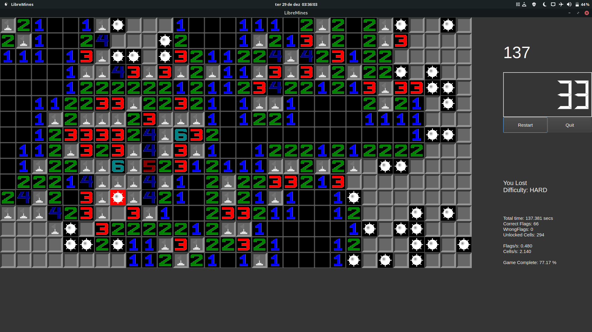
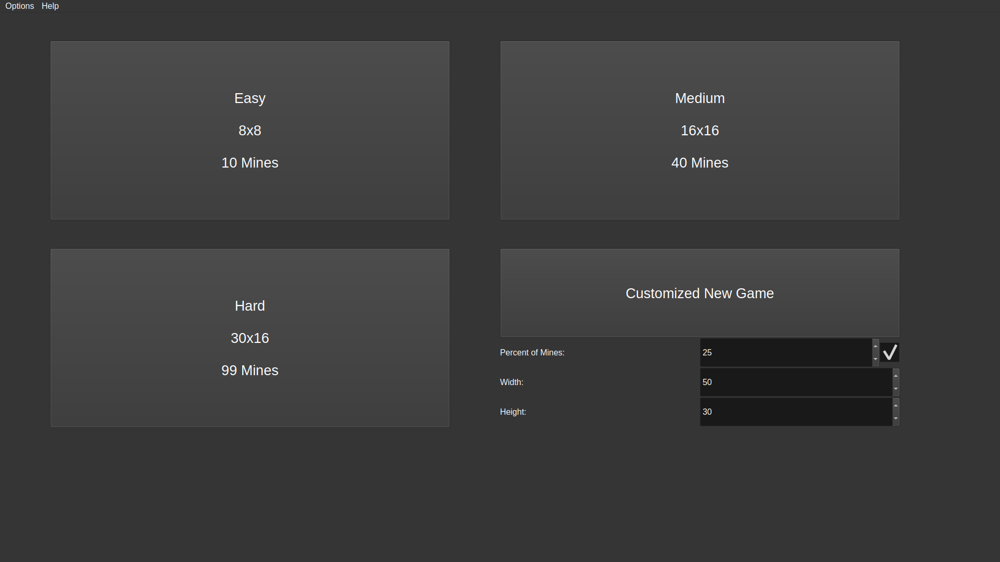

# [LibreMines](https://github.com/Bollos00/LibreMines)



## Introduction

LibreMines is a [Free/Libre](https://en.wikipedia.org/wiki/Free_software) and [Open Source](https://en.wikipedia.org/wiki/Open-source_software) software Qt based Minesweeper clone available for GNU/Linux, FreeBSD and Windows systems.

The source code is licensed under the [GNU General Public License at version 3](https://www.gnu.org/licenses/gpl-3.0.en.html) (or any later version), this includes all files inside the `src` directory. The artworks are licensed under the [Creative Commons Attribution-Share Alike 4.0 International](https://creativecommons.org/licenses/by-sa/4.0/), this includes all files on the `share` directory, except the files on `share/application_stylesheets` directory, which licenses are indicated with the `LICENSE` files inside subdirectories.

## Installing from Package Manager

[LibreMines is available on the Arch User Repository](https://aur.archlinux.org/packages/libremines/). With `yay` it can be installed with:

```sh
yay -S libremines
```

## Binary installation for Windows

For windows systems, if you do not want to install LibreMines from the source code, you can just get one of the releases [here](https://github.com/Bollos00/LibreMines/releases). And follow those steps:

* Download the file `libremines_vX.X.X_windows_release.zip` of the last version available;
* Extract it on your preferred location;

The executable `libremines.exe` will be inside the folder extracted. You can also add a Desktop shortcut or put it on the taskbar.

## Installing from the source code

### Installation Dependencies

The following dependencies are required for building and running LibreMines:
* [Qt5 Core](https://doc.qt.io/qt-5/qtcore-index.html) >= 5.12
* [Qt5 Widgets](https://doc.qt.io/qt-5/qtwidgets-index.html) >= 5.12
* [Qt5 SVG](https://doc.qt.io/qt-5/qtsvg-index.html) >= 5.12
* [CMake](https://cmake.org/) >= 3.1

Note: Qt6 is also supported

On Arch Linux and derivatives systems the dependencies can be installed with `pacman`:
```sh
sudo pacman -S base-devel qt5-base qt5-svg cmake
```

For Ubuntu you can install the dependencies with the following command:
```sh
sudo apt-get install build-essential qt5-default cmake libqt5svg5-dev
```

On Fedora, install the dependencies with:
```sh
sudo dnf install @development-tools
sudo dnf install qt-devel qt5-qtbase-devel qt5-qtsvg-devel cmake
```

On FreeBSD systems, install the packages [qt5-core](https://www.freshports.org/devel/qt5-core), [qt5-widgets](https://www.freshports.org/x11-toolkits/qt5-widgets/), [qt5-svg](https://www.freshports.org/graphics/qt5-svg/), [qt5-buildtools](https://www.freshports.org/devel/qt5-buildtools/), [qt5-qmake](https://www.freshports.org/devel/qt5-qmake/) [git](https://www.freshports.org/devel/git/) and [cmake](https://www.freshports.org/devel/cmake/). 

```sh
su -
pkg install qt5-core qt5-widgets qt5-svg git cmake qt5-buildtools qt5-qmake
```

For others systems, check the [qt online installers](https://download.qt.io/official_releases/online_installers/) or your preferred package manager.

### Building

In order to build LibreMines from the source code, follow those steps:
```sh
git clone https://github.com/Bollos00/LibreMines.git
cd LibreMines
mkdir build && cd build
cmake -DCMAKE_INSTALL_PREFIX=/usr/local ..
make
```

You can also get a stable release from [here](https://github.com/Bollos00/LibreMines/releases).

Note that the option `CMAKE_INSTALL_PREFIX` determines the target directory of the installation. If you want to install LibreMines using Qt6 libraries, additionally pass the argument `-DUSE_QT6="YES"` on the fourth step (the `cmake` part).

The executable `libremines` will be generated in the build directory, now it is possible to run it with:
```sh
./libremines
```

### Installing on the system (Unix only)

At least, if you want install LibreMines on your system, use the following command:
```sh
sudo make install
```

For uninstall LibreMines, on the `build` directory, run:
```sh
sudo xargs rm < install_manifest.txt
```

Or manually remove the files listed on `install_manifest.txt`.


## How to play

### First Steps

When you initialize the application, you will face this screen:




Here you can start to play one of the predefined game modes -- easy, medium and hard --, or you can customize the field the way that you want to play. Select one of those options and you will be ready to start. (Note the options on the upper left of the screen).

You will start the timer of the new game when you release the first cell, you can play with your mouse or with your keyboard.

### Playing with the mouse

* **Left Click**: release the cell which the mouse is pointing on;
* **Right Click**: flag/unflag the cell which the mouse is pointing on.

### Playing with the keyboard

For activate the keyboard controller mode, press one of the following keys: **A|S|D|W**

* **Escape**: Exit keyboard controller mode;

* **A**: Move Current Cell Left;

* **S**: Move Current Cell Downwards;

* **D**: Move Current Cell Right;

* **W**: Move Current Cell Upwards;

* **O**: Release Current Cell;

* **P**: Flag/Unflag Current Cell;

* **Space**: Locate current cell on middle of the scroll bar;

* **CTRL + R**: Retart the game;

* **CTRL + SHIFT + P**: Save minefield as image;

If you do not feel comfortable with those keys, you can edit them going to the main menu, then Options > Preferences.

Tip: hold the **CTRL** modifier while moving in order to move faster.


## Contributing

All kinds of contributions are welcome on this project. You can help:

* Making artworks (SVG) for minefield themes and new faces reaction;
* Documenting the source code and making tutorials of the game;
* Sharing the game in order to attract more users;
* Adapting the software for other Operational Systems;
* Packaging the software for other distributions;
* Increasing the playability and adding new features by making changes on the source code;
* Reporting new [issues](https://github.com/Bollos00/LibreMines/issues) or solving existing ones;
* Adding or improve the [translations](https://github.com/Bollos00/LibreMines/blob/master/etc/translations/README.md).

# Third party Repositories used in this software
* [BreezeStyleSheets](https://github.com/Alexhuszagh/BreezeStyleSheets)
* [GTRONICK/QSS](https://github.com/GTRONICK/QSS)
* [QDarkStyleSheet](https://github.com/ColinDuquesnoy/QDarkStyleSheet)
* [TwEmoji](https://github.com/twitter/twemoji)
* [OpenEmoji](https://github.com/hfg-gmuend/openmoji)
* [socialify](https://github.com/wei/socialify)
