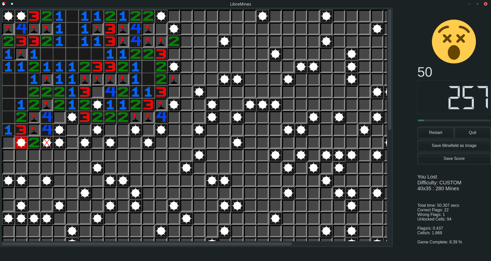

# [LibreMines](https://github.com/Bollos00/LibreMines)



## Introduction

LibreMines is a [Free/Libre](https://en.wikipedia.org/wiki/Free_software) and [Open Source](https://en.wikipedia.org/wiki/Open-source_software) software Qt based Minesweeper clone available for GNU/Linux, FreeBSD, macOS and Windows systems.

The game has dark and light themes, is widely customizable, has options to create customizable fields, allows the user to play even with the keyboard.

The source code is licensed under the [GNU General Public License at version 3](https://www.gnu.org/licenses/gpl-3.0.en.html) (or any later version), this includes all files inside the `src` directory. The artworks are licensed under the [Creative Commons Attribution-Share Alike 4.0 International](https://creativecommons.org/licenses/by-sa/4.0/), this includes all files on the `share` directory.

## Installing from Package Manager

### Arch User Repository

[LibreMines is available in Arch User Repository](https://aur.archlinux.org/packages/libremines/). It can be installed with an AUR helper:

To install using `yay`:
```sh
yay -Sy libremines
```

To install using `paru`:
```sh
paru -Sy libremines
```

To install manually using `git` **without** an AUR helper:
```sh
git clone https://aur.archlinux.org/libremines.git && cd libremines
makepkg -si
```

### FreeBSD

[LibreMines is available in FreeBSD ports tree](https://www.freshports.org/games/LibreMines). It can be installed with `pkg`:

```sh
pkg install libremines
```

### Flatpak

[LibreMines is available in FlatHub](https://flathub.org/apps/details/io.github.Bollos00.LibreMines). It can be installed with `flatpak`:

```sh
flatpak install flathub io.github.Bollos00.LibreMines
```

## Downloads & Releases

Pre-built binaries are available for multiple platforms. Download the latest release from the [Releases page](https://github.com/Bollos00/LibreMines/releases).

### Available Formats

| Platform    | Format       | Qt Version | Architecture    | Notes                                                                    |
|-------------|--------------|------------|-----------------|--------------------------------------------------------------------------|
| **Linux**   | AppImage     | Qt5/Qt6    | x86_64          | Make executable with `chmod +x LibreMines*.AppImage` and run directly    |
| **macOS**   | .dmg package | Qt5/Qt6    | Intel & ARM64   | Open the .dmg file, drag libremines to Applications folder. If you are unable to launch the application,  [follow instructions here](https://support.apple.com/en-gb/guide/mac-help/mh40616/26/mac/26) |
| **Windows** | ZIP Archive  | Qt5/Qt6    | x64             | Extract the ZIP archive to any folder and run `libremines.exe`           |

## Compiling from the source code

### Installation Dependencies

The following dependencies are required for building and running LibreMines:
* [Qt Core](https://doc.qt.io/qt-5/qtcore-index.html) >= 5.12
* [Qt Gui](https://doc.qt.io/qt-5/qtgui-index.html) >= 5.12
* [Qt Widgets](https://doc.qt.io/qt-5/qtwidgets-index.html) >= 5.12
* [Qt SVG](https://doc.qt.io/qt-5/qtsvg-index.html) >= 5.12
* [Qt Multimedia](https://doc.qt.io/qt-5/qtmultimedia-index.html) >= 5.12
* [CMake](https://cmake.org/) >= 3.10

On Arch Linux and derivatives, the dependencies can be installed with `pacman`:
```sh
sudo pacman -Sy --needed base-devel qt6-base qt6-svg qt6-multimedia cmake
```

On Debian Linux and derivatives, the dependencies can be installed with `apt`:
```sh
sudo apt-get install build-essential qt6-base-dev cmake libqt6svg6-dev qt6-multimedia-dev libgl1-mesa-dev
```

On Fedora Linux and derivatives, the dependencies can be installed with `dnf`:
```sh
sudo dnf install qt6-qtbase-devel qt6-qtsvg-devel cmake qt6-qtmultimedia-devel git
```

On FreeBSD systems, the dependencies can be installed with `pkg`:

```sh
su -
pkg install qt6-base qt6-svg qt6-multimedia git cmake
```

On macOS systems, the dependencies can be installed with [homebrew](https://brew.sh/):
```sh
brew install cmake ninja qt
```

For others systems, check out the [qt online installers](https://download.qt.io/official_releases/online_installers/) or use your preferred package manager to install dependencies.

### Building

In order to build LibreMines from the source code, run these commands:
```sh
git clone https://github.com/Bollos00/LibreMines.git
cd LibreMines
mkdir build && cd build
cmake -DCMAKE_INSTALL_PREFIX=/usr/local ..
make
```

You can also get a stable release from [here](https://github.com/Bollos00/LibreMines/releases).

Note that the option `CMAKE_INSTALL_PREFIX` determines the target directory of the installation. If you want to install LibreMines using Qt5 libraries, additionally pass the argument `-DUSE_QT6="NO"` on the fourth step (the `cmake` part).

The executable `libremines` will be generated in the build directory, now it is possible to run it with:
```sh
./libremines
```

### Installing on the system (Unix only)

At least, if you want install LibreMines on your system, use the following command:
```sh
sudo make install
```

To uninstall LibreMines, run this while on the `build` directory:
```sh
sudo xargs rm < install_manifest.txt
```

Or manually remove the files listed on `install_manifest.txt`.


## How to play

### First Steps

When you initialize the application, you will face this screen:


Here you can start to play one of the predefined game modes: easy, medium and hard; or you can customize the field the way that you want to play. Select one of these options and you are ready to start. (Also notice "Options" on the menu bar).

You will start the timer when you release the first cell, you can play with your mouse or with your keyboard.

### Playing with the mouse

* **Left Click**: Release the cell which the mouse is pointing on;
* **Right Click**: Flag/unflag the cell which the mouse is pointing on.

### Playing with the keyboard

To activate the keyboard controller mode, press either **W**, **A**, **S** or **D**.

* **Escape**: Exit Keyboard Controller Mode

* **A**: Move Current cell Left

* **S**: Move Current Cell Downwards

* **D**: Move Current Cell Right

* **W**: Move Current Cell Upwards

* **O**: Release Current Cell

* **P**: Flag/Unflag Current Cell

* **Space**: Locate current cell on middle of the scroll bar

* **CTRL + R**: Restart the game

* **CTRL + SHIFT + P**: Save minefield as image

If you do not feel comfortable with these keys, you can edit them by going to the main menu, then Options > Preferences.

Tip: Hold the **CTRL** modifier while moving in order to move faster.

## Contributing

All kinds of contributions are welcome on this project. You can help by:

* Making artworks (SVG) for [minefield themes](https://github.com/Bollos00/LibreMines/blob/master/share/minefield_themes/README.md) and new faces reaction
* Documenting the source code and making tutorials of the game
* Sharing the game in order to attract more users
* Adapting the software for other operating systems
* Packaging the software for other distributions
* Increasing the playability and adding new features by making changes on the source code
* Reporting new [issues](https://github.com/Bollos00/LibreMines/issues) or solving existing ones
* Adding or improving the [translations](https://github.com/Bollos00/LibreMines/blob/master/etc/translations/README.md)

# Third party Repositories used in this software
* [TwEmoji](https://github.com/twitter/twemoji)
* [OpenEmoji](https://github.com/hfg-gmuend/openmoji)
* [socialify](https://github.com/wei/socialify)
