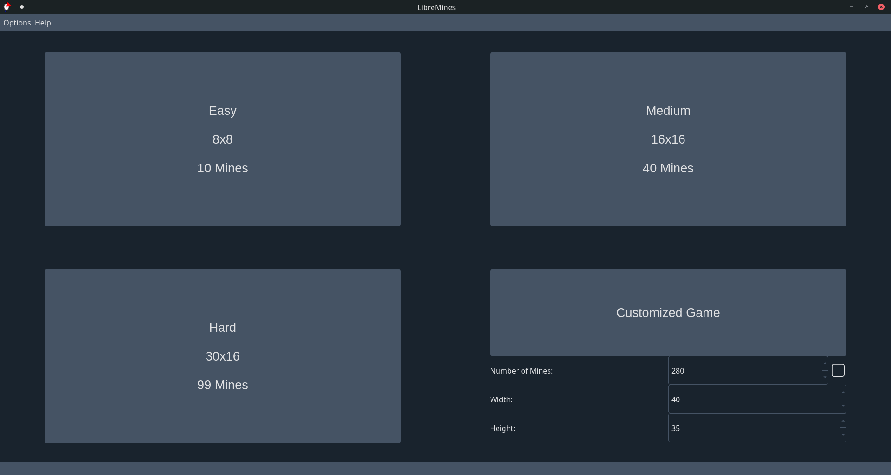

# [LibreMines](https://github.com/Bollos00/LibreMines)


## Installation

### Installing Dependencies

The following dependencies are required for building and running LibreMines:
* [Qt5 Core](https://doc.qt.io/qt-5/qtcore-index.html) >= 5.12
* [Qt5 Widgets](https://doc.qt.io/qt-5/qtwidgets-index.html) >= 5.12
* [CMake](https://cmake.org/) >= 3.1

Note: Qt6 is also supported

On Arch Linux and derivatives systems the dependencies can be installed with pacman:
```sh
sudo pacman -S base-devel qt5-base cmake
```

For ubuntu you can install the dependencies with the following command:
```sh
sudo apt-get install build-essential qt5-default cmake
```

On FreeBSD systems, install the packages [qt5-core](https://www.freshports.org/devel/qt5-core), [qt5-widgets](https://www.freshports.org/x11-toolkits/qt5-widgets/), [git](https://www.freshports.org/devel/git/) and [cmake](https://www.freshports.org/devel/cmake/)

```sh
su -
pkg install qt5-core qt5-widgets git cmake
```

For others systems, check the [qt online installers](https://download.qt.io/official_releases/online_installers/) or your preferred package manager.

### Building

Follow those steps for build LibreMines from source code:
```sh
git clone https://github.com/Bollos00/LibreMines.git
cd LibreMines
mkdir build && cd build
cmake -DCMAKE_INSTALL_PREFIX=/usr/local ..
make
```

Note that the option `CMAKE_INSTALL_PREFIX` determines the target directory of the installation. If you want to install LibreMines Qt6 libraries, additionally pass the argument `-DUSE_QT6="YES"`.

The executable `libremines` will be generated in the build directory, now it is possible to run it with:
```sh
./libremines
```

### Installing on the system

At least, if you want install LibreMines on your system, use the following command:
```sh
sudo make install
```

## How to play

### First Steps

When you initialize the application, you will face this screen:




Here you can start to play one of the predefined game modes -- easy, medium and hard --, or you can customize the field the way that you want to play. Select options one of those and you will be ready to start. (Note the options on the bottom left of the screen).

You will start the timer of the new game when you release the first cell, you can play with your mouse or with your keyboard.

### Playing with the mouse

* **Left Click**: release the cell the mouse is pointing on;
* **Right Click**: flag/unflag the cell which the mouse is pointing on.

### Playing with the keyboard

For activate the keyboard controller mode, press one of the following keys: **A|S|D|W**

* **Escape**: Exit keyboard controller mode;

* **A**: Move Current Cell Left;

* **S**: Move Current Cell Downwards;

* **D**: Move Current Cell Right;

* **W**: Move Current Cell Upwards;

* **O**: Release Current Cell;

* **P**: Flag/Unflag Current Cell;

If you do not feel comfortable with those keys, you can edit them going to the main menu, then Options > Preferences.

Tip: hold the **Control Key** while moving to go to one extreme of the field.
